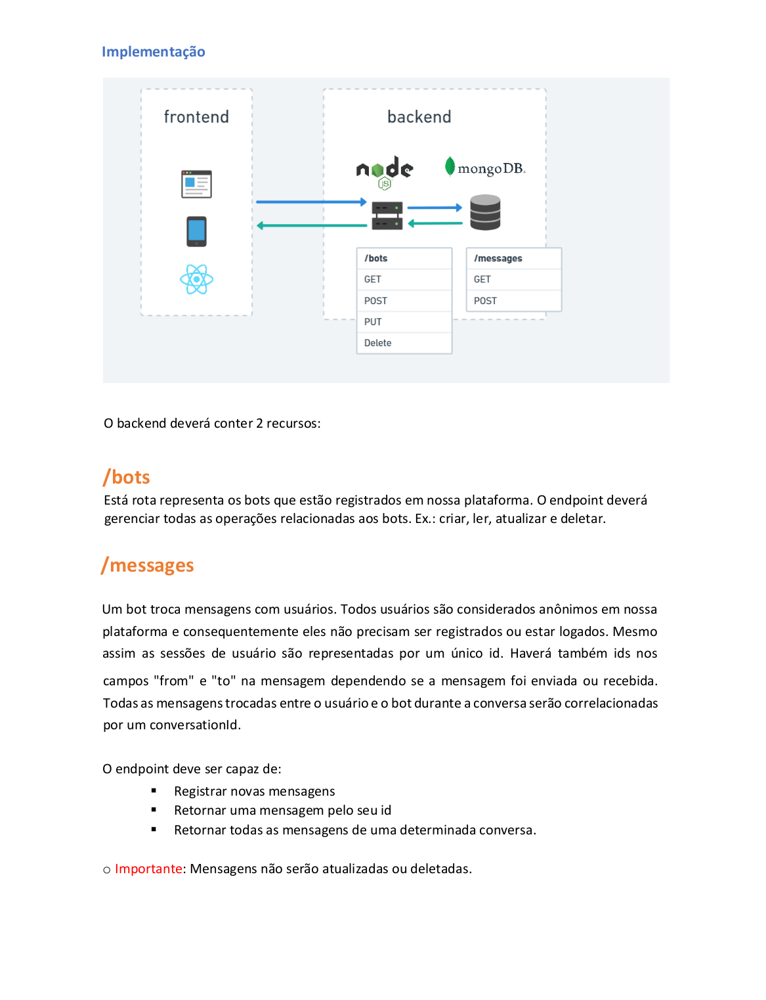
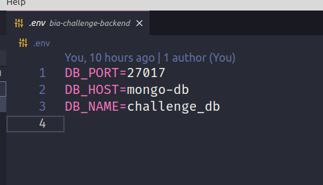
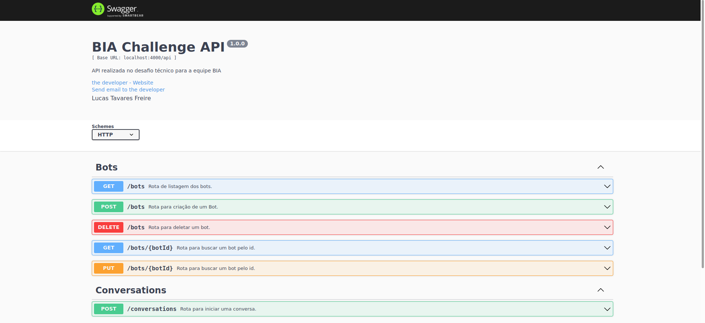

<h1 align="center">
  Desafio técnico – BIA - BackEnd
  <br>
</h1>

<p align="center">
    <a alt="TypeScript">
        
    </a>
    <a alt="NodeJs">
        
    </a>
    <a alt="TypeScript">
        
    </a>
    <a alt="Flyway">
        
    </a>
        <a alt="Jest">
        
    </a>
    <a alt="Swagger-UI">
        
    </a>
    <a alt="MongoDB">
        
    </a>
    <a alt="ExpressJs">
        
    </a>
    <a alt="SocketIO">
        
    </a>
</p>

## Índice

1. [Descrição do desafio](#Descrição-desafio)
2. [Tecnologias](#Tecnologias)
3. [Design Patterns e Metodologias](#Design-patterns)
4. [Metodologias](#Metodologias)
5. [Instruções de uso](#Instruções-de-uso)
6. [Documentação REST](#Documentação-REST)

## Descrição do desafio

</a>

## Tecnologias

Principais ferramentas e tecnologias utilizadas no projeto:

- **npm** - Gerenciador de dependências
- **TypeScript** - Linguagem de programação
- **NodeJS** - Interpretador JavaScript/TypeScript
- **ExpressJS** - Framework para API em NodeJS
- **MongoDB** - Banco de dados não relacional
- **TypeORM** - ORM para Typescript
- **SocketIO** - Protocolo de comunicação em tempo real
- **Jest** - Framework para testes
- **Docker** - Framework de conteinerização
- **Swagger** - Documentação de API
- **Yup** - Biblioteca de validação de esquemas
- **ESLint** - Ferramenta de padronização de códigos
- **Prettier** - Formatador de códigos

## Design Patterns e Metodologias

Principais ferramentas e tecnologias utilizadas no projeto:

- **Clean Architecture**
- **SOLID**
- **Factory**
- **Dependency Injection**
- **Keep It Simple, Silly (KISS)**

## Instruções de uso

**1. Clonar repositório**

**2. Build e start usando docker**

- Serão criados dois containers, mongo-db e bia-challenge

```bash
docker-compose build
docker-compose up -d
```

**3. Start usando npm**

- Necessário uma conexão com o MongoDB, configurar no .env do projeto antes de executar

</a>

```bash
npm install
npm start
```

Aplicação estará disponível em <http://localhost:4000>.

## Documentação REST

**Os recursos REST da api estão documentados com Swagger, disponíveis uma vez que o projeto estiver rodando: [http://localhost:4000/api/docs/](http://localhost:4000/api/docs/)**

</a>

**Exemplo de requisições**

- Na pasta raiz do projeto existe um arquivo de importação para o Insomnia com exemplo de todas as requisições (Insomnia_bia-challenge)

## Contribuidores

[Lucas Tavares](https://www.linkedin.com/in/lucas-tavares-a25323116/)
